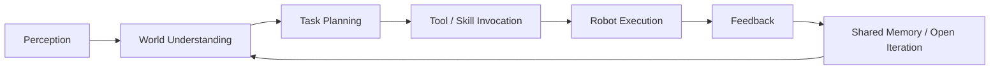

<p align="center">
  
</p>

<h1 align="center">⚙️ OSRBOT // OPEN SOURCE ROBOTICS</h1>

<p align="center">
  <b>Open Source Robotics</b> · <b>Embodied AI</b> · <b>AI Agents</b> · <b>Autonomy</b> · <b>Perception</b> · <b>Control</b>
</p>

<p align="center">
  
  
  
  
</p>

---

## `> SYSTEM BOOT`

```text
[ OK ] Open Robotics Protocol Loaded
[ OK ] Sensor Grid Linked
[ OK ] Motion Stack Ready
[ OK ] Agent Runtime Active
[ OK ] Community Interface Enabled
[ OK ] Open Collaboration Stable
````

> **OSRBOT = Open Source Robotics.**
> 我们相信机器人不该是封闭孤岛，而应成为一个 **开放、可复用、可协作、可持续演进** 的技术体系。
> 从机器人本体到 AI Agent，从感知到决策，从仿真到部署，我们致力于构建真正面向现实世界的 **开放机器人生态**。

---

## `> WHAT OSRBOT STANDS FOR`

### 🌍 Open Source Robotics

* 开放代码，而不是封闭黑盒
* 开放协作，而不是重复造轮子
* 开放生态，而不是单点工具
* 开放标准，而不是割裂系统

### 🤖 Robotics for the Real World

* 面向真实任务
* 面向系统落地
* 面向长期维护
* 面向社区共建

### 🧠 AI Agents for Robots

* 让机器人具备理解、规划、行动能力
* 让 Agent 不只是会回答，更要会执行
* 让智能系统可以接入工具、环境与反馈闭环

---

## `> CORE DIRECTIVES`

<table>
  <tr>
    <td width="33%" valign="top">

### 🤖 Embodied Intelligence

* 多模态感知
* 世界建模
* 任务理解
* 具身决策

    </td>
    <td width="33%" valign="top">

### 🧠 Agent Systems

* Tool Use
* Planning / ReAct
* Memory / RAG
* Multi-Agent Coordination

    </td>
    <td width="33%" valign="top">

### ⚡ Open Robotics Stack

* Motion Planning
* Control Stack
* Simulation to Real
* Reusable Infrastructure

    </td>
  </tr>

</table>

---

## `> OPEN SOURCE PHILOSOPHY`

```text
001 // Open code accelerates robotics.
002 // Shared tools beat isolated reinvention.
003 // Agents should act in the world, not only talk.
004 // Good robotics must survive real constraints.
005 // Simplicity, elegance, effectiveness.
006 // Community is part of the architecture.
```

---

## `> COMBAT MODULES / TECH STACK`

<p align="center">
  
</p>

```yaml
osrbot:
  meaning: open_source_robotics

  principles:
    - open_collaboration
    - modular_architecture
    - reproducible_systems
    - engineering_practicality
    - real_world_deployment

  stack:
    embodied_ai:
      - perception
      - world_model
      - planning
      - control

    agent_systems:
      - llm_orchestration
      - memory
      - retrieval
      - tool_calling
      - multi_agent_workflows

    robotics_infra:
      - ros2
      - simulation
      - deployment
      - observability
      - ci_cd
```

---

## `> MISSION PROFILE`

### 🛰️ 我们在做什么

* 构建面向真实世界任务的 **开放机器人系统**
* 构建能与机器人系统深度结合的 **AI Agent**
* 打通从 **感知 → 规划 → 执行 → 反馈** 的工程闭环
* 让机器人能力以 **开源组件、可复用模块、共享基础设施** 的形式持续生长

### 🛠️ 我们关注什么

* Open Source Robotics
* Agent for Robotics
* Embodied AI
* VLA / VLM / World Model
* Navigation / Manipulation / Mobile Robots
* Simulation / Digital Twin / Evaluation
* Human-Robot Interaction
* Open Tooling / Open Infrastructure / Open Ecosystem

---

## `> WHY OPEN SOURCE ROBOTICS`

| Direction         | What We Believe        |
| ----------------- | ---------------------- |
| `Open Code`       | 机器人能力应可学习、可复现、可扩展      |
| `Open Modules`    | 感知、规划、控制、Agent 都应模块化协同 |
| `Open Ecosystem`  | 真正强大的机器人系统来自社区共同演化     |
| `Open Standards`  | 开放接口比封闭工具更能推动行业前进      |
| `Open Deployment` | 从仿真到真机，能力应尽可能可迁移、可验证   |

---

## `> FEATURED REPOSITORIES`

> 将下面仓库名替换成你的真实项目。

| Module | Repository                                                           | Description                                            |
| ------ | -------------------------------------------------------------------- | ------------------------------------------------------ |
| `01`   | [`osrbot-agent-core`](https://github.com/OSRBOT/osrbot-agent-core)   | AI agent runtime for robotics, planning, tools, memory |
| `02`   | [`osrbot-robot-stack`](https://github.com/OSRBOT/osrbot-robot-stack) | Open robot middleware, perception, planning, control   |
| `03`   | [`osrbot-sim`](https://github.com/OSRBOT/osrbot-sim)                 | Simulation, evaluation, digital twin workflows         |
| `04`   | [`osrbot-vision`](https://github.com/OSRBOT/osrbot-vision)           | Vision, detection, tracking, scene understanding       |
| `05`   | [`osrbot-deploy`](https://github.com/OSRBOT/osrbot-deploy)           | Deployment, infra, observability, reproducible ops     |

---

## `> AGENT EXECUTION LOOP`



---

## `> OSRBOT MANIFEST`

> **OSRBOT 不只是一个名字。**
> 它代表我们对未来机器人系统的看法：

* 机器人应该是 **开放构建** 的
* 智能体应该是 **可执行** 的
* 系统能力应该是 **可复用** 的
* 工程成果应该是 **可共享** 的
* 生态发展应该是 **社区驱动** 的

---

## `> SIGNALS`

<p align="center">
  
  
  
  
  
</p>

---

## `> JOIN THE HANGAR`

### 我们欢迎这样的人

* 认同 **Open Source Robotics** 的价值
* 热爱 **机器人 / AI Agent / 系统工程**
* 愿意做长期主义的基础建设
* 追求 **简单、优雅、有效**
* 乐于将能力沉淀为开源模块与公共资产

### 我们关注的方向

* Robotics Engineer
* Embodied AI Engineer
* Agent / LLM Engineer
* Perception / Planning / Control Engineer
* Simulation / Infrastructure Engineer
* Open Source Maintainer

---

## `> COMMUNICATION CHANNELS`

<p align="center">
  <a href="https://github.com/OSRBOT"></a>
  <a href="https://github.com/OSRBOT"></a>
</p>

---

## `> TERMINAL OUTPUT`

```text
> boot osrbot --meaning "open source robotics"
> loading open modules...
> linking robot stacks...
> enabling agent runtime...
> syncing community protocols...
> mission status: OPEN AND READY
```

<p align="center">
  <b>「Open Source Robotics for the real world.」</b>
</p>

<p align="center">
  <sub>OSRBOT © Open Source Robotics</sub>
</p>
