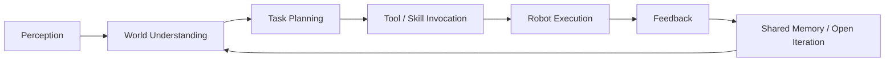

<p align="center">
  <a href="./README.md"><b>English</b></a> | <a href="./README_CN.md"><b>简体中文</b></a>
</p>

<p align="center">
  
</p>

<h1 align="center">⚙️ OSRBOT // OPEN SOURCE ROBOTICS</h1>

<p align="center">
  <b>Open Source Robotics</b> · <b>Embodied AI</b> · <b>AI Agents</b> · <b>Autonomy</b> · <b>Perception</b> · <b>Control</b>
</p>

<p align="center">
  
  
  
  
</p>

---

## `> SYSTEM BOOT`

```text
[ OK ] Open Robotics Protocol Loaded
[ OK ] Sensor Grid Linked
[ OK ] Motion Stack Ready
[ OK ] Agent Runtime Active
[ OK ] Community Interface Enabled
[ OK ] Open Collaboration Stable
````

> **OSRBOT = Open Source Robotics.**
> We believe robotics should not be a closed island. It should be an **open, reusable, collaborative, and continuously evolving** technology ecosystem.
> From robot systems to AI agents, from perception to decision-making, from simulation to deployment, we build **open robotics for the real world**.

---

## `> WHAT OSRBOT STANDS FOR`

### 🌍 Open Source Robotics

* Open code, not black boxes
* Open collaboration, not duplicated effort
* Open ecosystems, not isolated tools
* Open standards, not fragmented systems

### 🤖 Robotics for the Real World

* Built for real tasks
* Built for deployable systems
* Built for long-term maintainability
* Built with community contribution in mind

### 🧠 AI Agents for Robots

* Robots should be able to understand, plan, and act
* Agents should not only answer, but execute
* Intelligence should connect to tools, environments, and feedback loops

---

## `> CORE DIRECTIVES`

<table>
  <tr>
    <td width="33%" valign="top">

### 🤖 Embodied Intelligence

* Multimodal perception
* World modeling
* Task understanding
* Embodied decision-making

    </td>
    <td width="33%" valign="top">

### 🧠 Agent Systems

* Tool use
* Planning / ReAct
* Memory / RAG
* Multi-agent coordination

    </td>
    <td width="33%" valign="top">

### ⚡ Open Robotics Stack

* Motion planning
* Control stack
* Simulation to real
* Reusable infrastructure

    </td>
  </tr>

</table>

---

## `> OPEN SOURCE PHILOSOPHY`

```text
001 // Open code accelerates robotics.
002 // Shared tools beat isolated reinvention.
003 // Agents should act in the world, not only talk.
004 // Good robotics must survive real constraints.
005 // Simplicity, elegance, effectiveness.
006 // Community is part of the architecture.
```

---

## `> COMBAT MODULES / TECH STACK`

<p align="center">
  
</p>

```yaml
osrbot:
  meaning: open_source_robotics

  principles:
    - open_collaboration
    - modular_architecture
    - reproducible_systems
    - engineering_practicality
    - real_world_deployment

  stack:
    embodied_ai:
      - perception
      - world_model
      - planning
      - control

    agent_systems:
      - llm_orchestration
      - memory
      - retrieval
      - tool_calling
      - multi_agent_workflows

    robotics_infra:
      - ros2
      - simulation
      - deployment
      - observability
      - ci_cd
```

---

## `> MISSION PROFILE`

### 🛰️ What We Build

* Open robotic systems for real-world tasks
* AI agents deeply integrated with robotics workflows
* Full engineering loops from **perception → planning → execution → feedback**
* Reusable open modules, shared infrastructure, and deployable system components

### 🛠️ What We Care About

* Open Source Robotics
* Agent for Robotics
* Embodied AI
* VLA / VLM / World Model
* Navigation / Manipulation / Mobile Robots
* Simulation / Digital Twin / Evaluation
* Human-Robot Interaction
* Open Tooling / Open Infrastructure / Open Ecosystem

---

## `> WHY OPEN SOURCE ROBOTICS`

| Direction         | What We Believe                                                                      |
| ----------------- | ------------------------------------------------------------------------------------ |
| `Open Code`       | Robotics capabilities should be learnable, reproducible, and extensible              |
| `Open Modules`    | Perception, planning, control, and agents should work as modular systems             |
| `Open Ecosystem`  | Strong robotics systems emerge through community evolution                           |
| `Open Standards`  | Open interfaces move the field forward faster than closed tooling                    |
| `Open Deployment` | Capabilities should transfer from simulation to real systems as reliably as possible |

---

## `> FEATURED REPOSITORIES`

> Replace these with your actual repositories.

| Module | Repository                                                           | Description                                                     |
| ------ | -------------------------------------------------------------------- | --------------------------------------------------------------- |
| `01`   | [`osrbot-agent-core`](https://github.com/OSRBOT/osrbot-agent-core)   | AI agent runtime for robotics, planning, tools, memory          |
| `02`   | [`osrbot-robot-stack`](https://github.com/OSRBOT/osrbot-robot-stack) | Open robot middleware, perception, planning, control            |
| `03`   | [`osrbot-sim`](https://github.com/OSRBOT/osrbot-sim)                 | Simulation, evaluation, and digital twin workflows              |
| `04`   | [`osrbot-vision`](https://github.com/OSRBOT/osrbot-vision)           | Vision, detection, tracking, and scene understanding            |
| `05`   | [`osrbot-deploy`](https://github.com/OSRBOT/osrbot-deploy)           | Deployment, infrastructure, observability, and reproducible ops |

---

## `> AGENT EXECUTION LOOP`



---

## `> OSRBOT MANIFEST`

> **OSRBOT is more than a name.**
> It reflects how we think robotics systems should be built:

* Robotics should be **open by design**
* Agents should be **actionable**
* System capabilities should be **reusable**
* Engineering outputs should be **shareable**
* Ecosystems should be **community-driven**

---

## `> SIGNALS`

<p align="center">
  
  
  
  
  
</p>

---

## `> JOIN THE HANGAR`

### We Welcome People Who

* Believe in the value of **Open Source Robotics**
* Care deeply about **robotics, AI agents, and systems engineering**
* Want to build long-term foundational infrastructure
* Value **simplicity, elegance, and effectiveness**
* Enjoy turning engineering work into open modules and shared public assets

### Areas We Care About

* Robotics Engineer
* Embodied AI Engineer
* Agent / LLM Engineer
* Perception / Planning / Control Engineer
* Simulation / Infrastructure Engineer
* Open Source Maintainer

---

## `> COMMUNICATION CHANNELS`

<p align="center">
  <a href="https://github.com/OSRBOT"></a>
  <a href="https://github.com/OSRBOT"></a>
</p>

---

## `> TERMINAL OUTPUT`

```text
> boot osrbot --meaning "open source robotics"
> loading open modules...
> linking robot stacks...
> enabling agent runtime...
> syncing community protocols...
> mission status: OPEN AND READY
```

<p align="center">
  <b>“Open Source Robotics for the real world.”</b>
</p>

<p align="center">
  <sub>OSRBOT © Open Source Robotics</sub>
</p>

---
